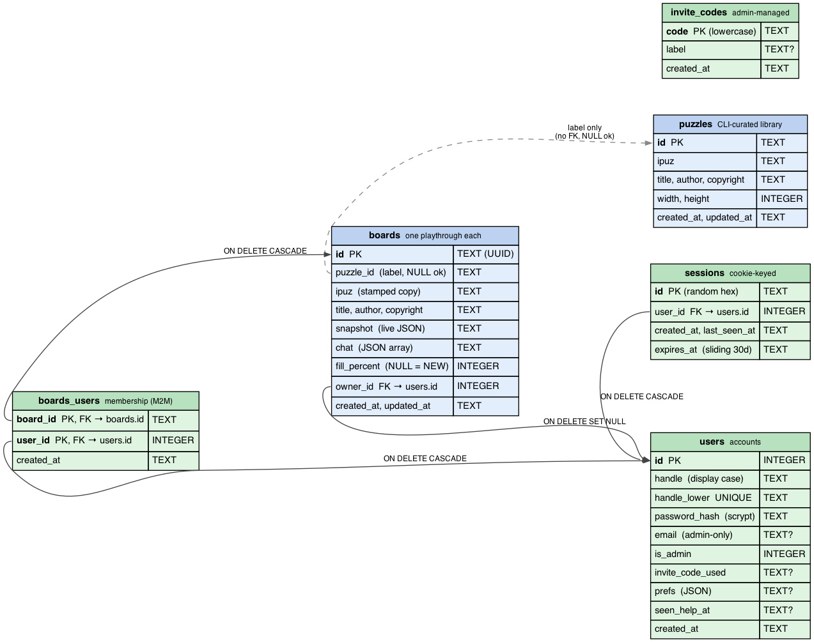

# Architecture

A walkthrough of how Crossplay is put together, aimed at someone who just wants the lay of the land.

## Three packages

Crossplay is an npm-workspaces monorepo with three packages:

- **`shared`** — TypeScript types only, no runtime code. The wire protocol (what flies between client and server) lives here so both sides agree on shape.
- **`server`** — Node + Fastify + Node's built-in `node:sqlite`. Owns the persistent library (puzzles), the persistent playthroughs (boards), accounts and sessions, and a WebSocket per board. Parses `.puz` via `puzjs` and `.ipuz` directly.
- **`client`** — React + Vite + TypeScript with CSS Modules. Renders the grid, handles input, and stays in sync with the server.

In production, the server also serves the built client static files, so it's a single Node process behind nginx. In development, the client is served by Vite and proxies API/WebSocket calls to the server on a separate port.

## Puzzles vs boards

The data model has two first-class entities, and confusing them creates real bugs.

- A **puzzle** is a *template* — an immutable canonical-form ipuz blob in the `puzzles` table, imported via the CLI script (`scripts/import-puzzle.ts`). Puzzles are never created or modified via HTTP. Think Word *templates*.
- A **board** is *one playthrough* — a row in the `boards` table that copies the puzzle's full ipuz blob and starts maintaining its own live snapshot, chat, and metadata. Boards are stamped from a puzzle (or from an ad-hoc file upload). Once stamped, a board is fully self-contained: re-importing the puzzle doesn't touch existing boards, and deleting the puzzle leaves boards playable. Think Word *documents*.

`boards.puzzle_id` records which puzzle slug a board came from, but it's a label, not a foreign key — it's nullable (ad-hoc uploads have no puzzle row at all) and may dangle (the puzzle was deleted later). Either way, everything play needs is on the board.

In user-facing copy these become "Puzzle library" and "Your games." In code, never use the word *game* — it's ambiguous between the two.

## Accounts, sessions, and board membership

Users exist (Phase 1+2+3 of the users feature; see `docs/users-design.md` for the source of truth). The shape:

- **Posture A — anon URL play.** Visiting `/b/<id>` works without a login, same as before. Anyone with the URL can play, chat as `Rando<NN>`, and read/write the board. The unguessable UUID is the access barrier. The home page (`/`), library browse, and upload are account-only — visiting `/` while signed out shows a `LandingPage` (login + signup + invite-code paragraph) instead.
- **Registration is invite-code gated.** No email verification, no password reset, no OAuth — the trust model is friends-of-friends. Admins curate `invite_codes` rows by hand via SQL; signup requires a valid (case-insensitive) code.
- **Sessions live in SQLite**, keyed by a random 32-byte hex token. The token is the value of an HTTP-only `crossplay_session` cookie, sliding 30-day expiry. A Fastify `onRequest` hook resolves `req.user` on every request; routes that require auth check that field themselves.
- **Boards have an owner *and* members.** `boards.owner_id` records the creator (FK with `ON DELETE SET NULL`). The `boards_users` join table records who has the board in their "My Games" — the owner is auto-inserted on creation, and shares add rows. The home page list queries through the join, so boards I created *and* boards shared with me both surface.
- **`DELETE /api/boards/:id` is "leave this board."** It removes my membership row. If I was the last member, the board is hard-deleted (force-close WS sockets, evict cache) in the same DB transaction.
- **Multiple boards per (user, puzzle) are allowed.** A user can legitimately want one solo board and one collab board on the same puzzle. The library click does a soft dedup — returns the most-recently-updated existing board, or creates a new one — but the schema doesn't enforce uniqueness. The share route is a plain idempotent insert with no collision branch.

The data model — six tables, the FKs between them, and the one intentionally-not-a-FK label edge from `boards.puzzle_id` to `puzzles.id` — is in [the schema diagram](docs/schema.png).

Source: [`docs/schema.dot`](docs/schema.dot) (regenerate with `dot -Tpng docs/schema.dot -o docs/schema.png`).

## How a keystroke travels

Probably the easiest way to understand the runtime is to follow one letter from finger to friend.

1. You press `K` in the grid. The client immediately renders `K` in your cell — no waiting on anyone. (More on this below.)
2. The client also sends a `fill` message over its WebSocket: "row, col, letter, your color."
3. The server validates (cell exists, isn't a block, letter looks sane), updates its in-memory copy of the board, bumps a version counter, and **broadcasts** a `cellUpdate` to every connected client on that board — including you.
4. Everyone applies the broadcast. You ignore your own update (you already have it). Your friend's client renders the `K` and briefly flashes it in your color so they can see what just changed.

Reveal, check, clear, chat, and "show notes" all follow the same shape: a small message goes up, server is the authority, the result fans out to everyone.

## Server-authoritative state, optimistic UI

The *server* is the source of truth for what's in the grid. But the *client* never waits for the server before showing your typing. Latency on a phone or shaky connection would be brutal otherwise.

The pattern: render locally, send to server, reconcile when the broadcast comes back. Because the server's response says exactly what each cell now contains (not a delta), reconciliation is trivial — just replace the cell with what the server says.

Reveal and check operations are server-authoritative too. They have to be: the solution lives only on the server (we don't ship it to the client), so only the server can know what "correct" means.

## Real-time via WebSocket

One WebSocket connection per browser tab per board, at `/ws/boards/:id`. The server holds the set of sockets per board and broadcasts to all of them on any change.

A 30-second server ping detects silently-dead connections (closed laptop lid, dead WiFi) within ~120 seconds — the server tolerates 3 consecutive missed pongs before terminating, because macOS App Nap throttles JS in backgrounded tabs and a single late pong shouldn't kill an idle solver. The client's reconnect logic retries with exponential backoff and re-announces presence on each reconnect.

There's no protocol versioning, no schema negotiation, no acks beyond the cell-update broadcasts. The wire is small and untyped past the JSON; the server validates each incoming message defensively.

## Two classes of WebSocket message

The wire carries two architecturally distinct kinds of message, and they have different rules:

- **State changes** — `fill`, `reveal`, `check`, `clear`, `chat`, `showNotes`. The server is authoritative, mutations bump a snapshot version, broadcasts are durable (persisted via the 15-second flush), and clients reconcile by version.
- **Pure presence** — `cursorMoved` (peer cursor position), `cursorLeft` (peer disconnected), and the "X joined" feedback derived from `hello`. None of this is persisted, version-stamped, or replayed on reconnect. A peer that misses a `cursorMoved` while reconnecting just sees the next one. The cost of presence traffic is intentionally cheap so it can't impact the typing hot path (see `project_optimistic_typing.md`): outbound `cursorMoved` is throttled to ~80ms on the client and is fire-and-forget; inbound updates only re-render the affected cell.

## Persistence: SQLite

The server uses Node's built-in `node:sqlite` (synchronous, ships with Node 22.5+, stable in 24+). Six tables; see [the schema diagram](docs/schema.png) for the columns and FKs at a glance.

- `puzzles` — CLI-curated library. id, ipuz blob, denormalized title/author/copyright/width/height, timestamps.
- `boards` — one playthrough each. id, nullable `puzzle_id` (a label, not a FK), ipuz blob (a copy at stamp time), denormalized title/author/copyright, JSON snapshot, JSON chat, timestamps, nullable `fill_percent` (updated on flush so the home page can show NEW / N% / 100% without re-parsing), nullable `owner_id` (FK to users, SET NULL on user delete).
- `users` — accounts. id, `handle` (case-preserved for display) + `handle_lower` (UNIQUE, the lookup column), scrypt `password_hash`, nullable email (admin out-of-band use only), `is_admin` flag, `invite_code_used` (forensic — "delete every account from this code"), `prefs` JSON column (machinery wired up but empty by design — see `docs/user-preferences-backlog.md`), `seen_help_at` timestamp (NULL = never seen the help dialog; `UPDATE users SET seen_help_at = NULL` re-shows it), `created_at`.
- `invite_codes` — `code` PK (stored lowercased), optional `label`, `created_at`. Admins INSERT/DELETE by hand to grant/revoke registration access.
- `sessions` — server-side session table. Random hex `id` PK (sent as the cookie value), `user_id` FK (CASCADE on user delete), creation / last-seen / sliding expiry timestamps.
- `boards_users` — the membership M2M. Composite PK `(board_id, user_id)`, both FKs CASCADE on delete. Owner is auto-inserted on board creation; the share route adds rows; "leave board" deletes the caller's row and hard-deletes the board if it was the last membership.

Migrations are tracked via SQLite's built-in `PRAGMA user_version` — `db.ts` walks an append-only `migrations[]` array, runs anything past the current version inside its own transaction, and bumps the version. No migrations table. The current head is v7.

What's persistent: the puzzle library, every board's existence + denormalized title/author, and the live snapshot + chat history. Mutations during play happen in-memory first; a per-board 15-second idle-debounced flush writes them back to the DB. The last socket leaving a board triggers a flush + cache eviction. SIGTERM/SIGINT drains every dirty cached board before exit. A hard crash within the 15-second window loses up to 15 seconds of play — by design (see `project_sqlite_sprint_plan.md`).

The in-memory cache (`store.ts`) keeps a board around as long as at least one socket is connected. It also retains the *initial* snapshot (parsed once from `boards.ipuz`) so the `clear` operation can restore to it without wiping author-prefilled cells.

## Some things we deliberately *didn't* use

- **No router library.** Three routes (`/`, `/b/<id>`, `/b/<id>/print`) handled by a 25-line `routing.ts`. If we ever grow to five-plus routes, swap in `wouter` (~2KB) before things tangle.
- **No Tailwind.** CSS Modules everywhere. The styling needs are modest enough that hand-written CSS reads cleaner than utility classes. (Some color values are quoted from Tailwind's palette because their picks are well-tuned, but the framework itself isn't a dependency.)
- **No state-management library.** React's `useState` plus a few `useRef`s for "I want the latest value without re-rendering" cases. The `Menu` component reads its action handlers from a ref that `PuzzleView` keeps current — that avoids re-rendering the menu on every cursor move while still letting clicks invoke the right things.
- **No build-time RPC layer.** The wire protocol is small enough to hand-write as TypeScript discriminated unions in `shared/`, validated on the server with simple type guards. tRPC or similar would add weight without saving much.

## Component tree

The client's React render tree at a glance. Solid edges are always-rendered children; dashed edges are conditional (route, load state, panel-open flag, or transient overlay). Hooks and pure helpers are omitted. The home page and the board page share very little structure, so they get one diagram each.

**Home page (`/`)** — solid-border nodes are real components; dashed-border nodes are logical UI sections that live as inline JSX inside `HomePage` (filter inputs, list rows, section wrappers) rather than their own files.

Source: [`docs/components-home.dot`](docs/components-home.dot) (regenerate with `dot -Tpng docs/components-home.dot -o docs/components-home.png`).

**Board page (`/b/:id`)** — App's header chrome plus `PuzzleView` and its panels.

Source: [`docs/components-game.dot`](docs/components-game.dot) (regenerate with `dot -Tpng docs/components-game.dot -o docs/components-game.png`).

## Frontend choices worth knowing

- **The cell is sized in `font-size`, and everything inside uses `em`.** This means letters, numbers, and the revealed/wrong corner triangles all scale together when the cell scales — including when Safari does text-only zoom (which would otherwise grow the letter past the cell box).
- **Layout is a `height: 100dvh` flex chain with `min-height: 0` on every flex item that should be allowed to shrink.** Removing those `min-height: 0`s breaks the layout in subtle ways; they're load-bearing. `dvh` (not `vh`) is mandatory on iOS Safari: `100vh` there includes the dynamic browser chrome (URL bar / bottom toolbar), so the layout would size taller than the visible area and the page would scroll past it. Same swap in the `Menu` and `HelpDialog` max-heights and in the `Board` cell-size calc.
- **The two big floating panels (chat and notes) use `react-rnd`** for drag and resize, with their position/size persisted to `localStorage` per panel. The Rect/load/save/clamp logic and the shared card/header/drag-handle CSS live in one place (`draggablePanel.ts` + `Panel.module.css`); each panel composes those bones and overrides the bits that differ.
- **Modifier keys bypass the keyboard handler.** `Cmd-L` focuses the address bar like usual; we don't try to capture browser shortcuts. `Option`/`Alt` + a letter is the namespace we use for in-app action shortcuts (`⌥R` reveal, `⌥C` check, `⌥N` notes, `⌥P` toggle pen/pencil, `⌥M` open the title menu). A few unmodified-keypress shortcuts also exist for things that open a dialog rather than mutate the board: `⇧Enter` (rebus overlay), `#` (jump-to-clue-number), `?` (help dialog), `/` (open chat or focus its input). See CLAUDE.md for the full list and rationale.
- **Menu is keyboard-navigable.** `⌥M` toggles the title menu; inside the menu, the first enabled item gets focus on open, ArrowUp/Down/Home/End move focus across the enabled buttons (re-queried each press so newly-enabled items participate), and Enter/Space activate natively. Tab stays reserved for next-clue, so arrows are the sole traversal — fine for a menu this small.
- **Five modal dialogs share a pattern.** `HelpDialog`, `NumberJumpDialog`, `ShareDialog`, `SolvedDialog` (the puzzle-completion celebration), and the inline `RebusInput` overlay are all centered cards with backdrop / Esc / × dismissal. `PuzzleView` tracks an `*Open` boolean per dialog plus a `*OpenRef` so its window-level keystroke handler can bail out cleanly while a dialog is taking input. The chat panel and notes panel are different — those are draggable `react-rnd` panels with persisted geometry.
- **Home page and board page have separate headers.** The shared top bar (small icon, title-with-menu, feedback slot) only renders on `/b/:id`. The home page (`/`) draws its own centered hero (large icon + wordmark) and intentionally has no menu — landing pages and play views have different needs and they no longer share a component.
- **First-visit help auto-open.** On first board-load for users who haven't dismissed the help dialog, `PuzzleView` opens `HelpDialog` automatically. The dismissed-flag is per-user (`users.seen_help_at`) for authed users and per-browser (`localStorage["crossplay.seenHelpAt"]`) for anons. Admins re-show the dialog after a help rewrite by clearing the column with SQL.
- **Feedback text is kept short.** The header pill truncates on a phone in the low-20-character range. Use the existing `Feedback` type — server emits when the cause is server-side, client when it's a local UI decision.
- **Home-page list filters are pure client-side.** Both lists do a case-insensitive substring match across title + author + copyright (so e.g. "times" finds NYT puzzles via the copyright field). The library is expected to stay in the hundreds; server-side filtering would buy nothing.

## What's deliberately out of scope

- Email verification, password reset flows, OAuth, SSO. Accounts exist (Phase 1+), but the trust model is friends-of-friends: invite codes are shared secrets the admin manages with raw SQL. A leaked code is fixed by deleting the row.
- Real-time share notifications. The home page's "members" + "live" columns are computed at request time; you refresh to see updates.
- Per-board ACLs / kick / report. Everyone in your circle is welcome — if a member becomes a problem, the social fix is removing them from the join row.
- Mobile / touch input *without a hardware keyboard*. Tablets and phones that have an external keyboard (option keys work on iPad/iPhone keyboards) get a "narrow mode" UI: side clue lists hidden, active clue moved to a 3-line strip below the grid, home page stacked vertically and page-scrollable. See CLAUDE.md "Platform philosophy" for the full audience priorities and the rules that follow (board page doesn't scroll, no hover-gated info, don't bloat tap targets at the expense of grid readability).
- A solve timer — flagged for future work and needs its own design conversation.
- Most non-standard `.puz` / `.ipuz` features (barred grids, non-crossword `kind`, named style references, unknown style or cell-object keys) are rejected at upload time with a clear message rather than partially loaded — the ipuz `style` check is a **whitelist** so brand-new features surface as a 400 rather than a quietly-stripped puzzle. The supported subset today: square grid, integer cell numbers, plain text clues, rebus solutions up to 8 characters, circled cells, shaded cells, author-prefilled givens (ipuz only), Schrödinger / multi-answer cells, and irregular grids (ipuz `null` cells render as transparent space). See `packages/server/src/ipuz.ts` for the per-feature handling.
