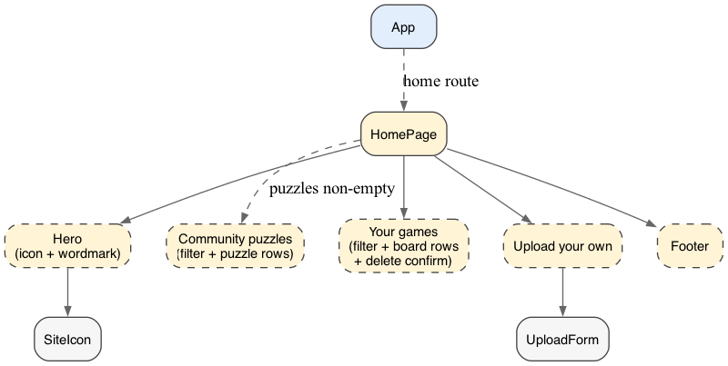
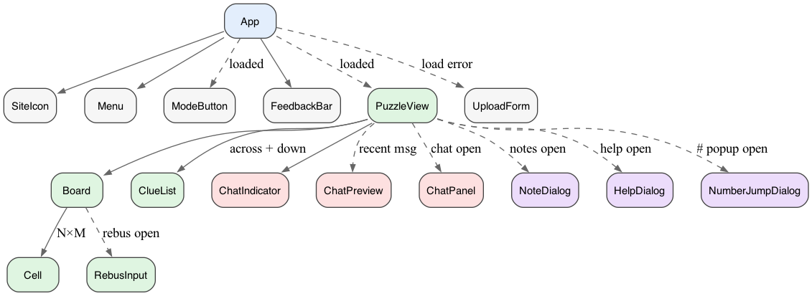

# Architecture

A walkthrough of how Crossplay is put together, aimed at someone who just wants the lay of the land.

## Three packages

Crossplay is an npm-workspaces monorepo with three packages:

- **`shared`** — TypeScript types only, no runtime code. The wire protocol (what flies between client and server) lives here so both sides agree on shape.
- **`server`** — Node + Fastify + Node's built-in `node:sqlite`. Owns the persistent library (puzzles), the persistent playthroughs (boards), and a WebSocket per board. Parses `.puz` via `puzjs` and `.ipuz` directly.
- **`client`** — React + Vite + TypeScript with CSS Modules. Renders the grid, handles input, and stays in sync with the server.

In production, the server also serves the built client static files, so it's a single Node process behind nginx. In development, the client is served by Vite and proxies API/WebSocket calls to the server on a separate port.

## Puzzles vs boards

The data model has two first-class entities, and confusing them creates real bugs.

- A **puzzle** is a *template* — an immutable canonical-form ipuz blob in the `puzzles` table, imported via the CLI script (`scripts/import-puzzle.ts`). Puzzles are never created or modified via HTTP. Think Word *templates*.
- A **board** is *one playthrough* — a row in the `boards` table that copies the puzzle's full ipuz blob and starts maintaining its own live snapshot, chat, and metadata. Boards are stamped from a puzzle (or from an ad-hoc file upload). Once stamped, a board is fully self-contained: re-importing the puzzle doesn't touch existing boards, and deleting the puzzle leaves boards playable. Think Word *documents*.

`boards.puzzle_id` records which puzzle slug a board came from, but it's a label, not a foreign key — it's nullable (ad-hoc uploads have no puzzle row at all) and may dangle (the puzzle was deleted later). Either way, everything play needs is on the board.

In user-facing copy these become "Community puzzles" and "Your games." In code, never use the word *game* — it's ambiguous between the two.

## How a keystroke travels

Probably the easiest way to understand the runtime is to follow one letter from finger to friend.

1. You press `K` in the grid. The client immediately renders `K` in your cell — no waiting on anyone. (More on this below.)
2. The client also sends a `fill` message over its WebSocket: "row, col, letter, your color."
3. The server validates (cell exists, isn't a block, letter looks sane), updates its in-memory copy of the board, bumps a version counter, and **broadcasts** a `cellUpdate` to every connected client on that board — including you.
4. Everyone applies the broadcast. You ignore your own update (you already have it). Your friend's client renders the `K` and briefly flashes it in your color so they can see what just changed.

Reveal, check, clear, chat, and "show notes" all follow the same shape: a small message goes up, server is the authority, the result fans out to everyone.

## Server-authoritative state, optimistic UI

The *server* is the source of truth for what's in the grid. But the *client* never waits for the server before showing your typing. Latency on a phone or shaky connection would be brutal otherwise.

The pattern: render locally, send to server, reconcile when the broadcast comes back. Because the server's response says exactly what each cell now contains (not a delta), reconciliation is trivial — just replace the cell with what the server says.

Reveal and check operations are server-authoritative too. They have to be: the solution lives only on the server (we don't ship it to the client), so only the server can know what "correct" means.

## Real-time via WebSocket

One WebSocket connection per browser tab per board, at `/ws/boards/:id`. The server holds the set of sockets per board and broadcasts to all of them on any change.

A 30-second server ping detects silently-dead connections (closed laptop lid, dead WiFi) within ~90 seconds — the server tolerates 2 consecutive missed pongs before terminating, because macOS App Nap throttles JS in backgrounded tabs and a single late pong shouldn't kill an idle solver. The client's reconnect logic retries with exponential backoff and re-announces presence on each reconnect.

There's no protocol versioning, no schema negotiation, no acks beyond the cell-update broadcasts. The wire is small and untyped past the JSON; the server validates each incoming message defensively.

## Two classes of WebSocket message

The wire carries two architecturally distinct kinds of message, and they have different rules:

- **State changes** — `fill`, `reveal`, `check`, `clear`, `chat`, `showNotes`. The server is authoritative, mutations bump a snapshot version, broadcasts are durable (persisted via the 15-second flush), and clients reconcile by version.
- **Pure presence** — `cursorMoved` (peer cursor position), `cursorLeft` (peer disconnected), and the "X joined" feedback derived from `hello`. None of this is persisted, version-stamped, or replayed on reconnect. A peer that misses a `cursorMoved` while reconnecting just sees the next one. The cost of presence traffic is intentionally cheap so it can't impact the typing hot path (see `project_optimistic_typing.md`): outbound `cursorMoved` is throttled to ~80ms on the client and is fire-and-forget; inbound updates only re-render the affected cell.

## Persistence: SQLite, partial today

The server uses Node's built-in `node:sqlite` (synchronous, ships with Node 22.5+, stable in 24+). Two tables, no FK between them:

- `puzzles` — id, ipuz blob, denormalized title/author/copyright/width/height, timestamps. Curated by the operator via CLI.
- `boards` — id, nullable puzzle_id, ipuz blob (a copy at stamp time), denormalized title/author/copyright, JSON snapshot, JSON chat, timestamps, plus a nullable `fill_percent` updated on flush so the home page can show NEW / N% / 100% without re-parsing the board.

Migrations are tracked via SQLite's built-in `PRAGMA user_version` — `db.ts` walks an append-only `migrations[]` array, runs anything past the current version inside its own transaction, and bumps the version. No migrations table.

What's persistent: the puzzle library, every board's existence + denormalized title/author, and the live snapshot + chat history. Mutations during play happen in-memory first; a per-board 15-second idle-debounced flush writes them back to the DB. The last socket leaving a board triggers a flush + cache eviction. SIGTERM/SIGINT drains every dirty cached board before exit. A hard crash within the 15-second window loses up to 15 seconds of play — by design (see `project_sqlite_sprint_plan.md`).

The in-memory cache (`store.ts`) keeps a board around as long as at least one socket is connected. It also retains the *initial* snapshot (parsed once from `boards.ipuz`) so the `clear` operation can restore to it without wiping author-prefilled cells.

## Some things we deliberately *didn't* use

- **No router library.** There are two routes (`/` and `/b/<id>`). A 25-line `routing.ts` handles them. If we ever grow to five-plus routes, swap in `wouter` (~2KB) before things tangle.
- **No Tailwind.** CSS Modules everywhere. The styling needs are modest enough that hand-written CSS reads cleaner than utility classes. (Some color values are quoted from Tailwind's palette because their picks are well-tuned, but the framework itself isn't a dependency.)
- **No state-management library.** React's `useState` plus a few `useRef`s for "I want the latest value without re-rendering" cases. The `Menu` component reads its action handlers from a ref that `PuzzleView` keeps current — that avoids re-rendering the menu on every cursor move while still letting clicks invoke the right things.
- **No build-time RPC layer.** The wire protocol is small enough to hand-write as TypeScript discriminated unions in `shared/`, validated on the server with simple type guards. tRPC or similar would add weight without saving much.

## Component tree

The client's React render tree at a glance. Solid edges are always-rendered children; dashed edges are conditional (route, load state, panel-open flag, or transient overlay). Hooks and pure helpers are omitted. The home page and the board page share very little structure, so they get one diagram each.

**Home page (`/`)** — solid-border nodes are real components; dashed-border nodes are logical UI sections that live as inline JSX inside `HomePage` (filter inputs, list rows, section wrappers) rather than their own files.

Source: [`docs/components-home.dot`](docs/components-home.dot) (regenerate with `dot -Tpng docs/components-home.dot -o docs/components-home.png`).

**Board page (`/b/:id`)** — App's header chrome plus `PuzzleView` and its panels.

Source: [`docs/components-game.dot`](docs/components-game.dot) (regenerate with `dot -Tpng docs/components-game.dot -o docs/components-game.png`).

## Frontend choices worth knowing

- **The cell is sized in `font-size`, and everything inside uses `em`.** This means letters, numbers, and the revealed/wrong corner triangles all scale together when the cell scales — including when Safari does text-only zoom (which would otherwise grow the letter past the cell box).
- **Layout is a `height: 100vh` flex chain with `min-height: 0` on every flex item that should be allowed to shrink.** Removing those `min-height: 0`s breaks the layout in subtle ways; they're load-bearing.
- **The two big floating panels (chat and notes) use `react-rnd`** for drag and resize, with their position/size persisted to `localStorage` per panel. The Rect/load/save/clamp logic and the shared card/header/drag-handle CSS live in one place (`draggablePanel.ts` + `Panel.module.css`); each panel composes those bones and overrides the bits that differ.
- **Modifier keys bypass the keyboard handler.** `Cmd-L` focuses the address bar like usual; we don't try to capture browser shortcuts. `Option`/`Alt` + a letter is the namespace we use for in-app action shortcuts (`⌥R` reveal, `⌥C` check, `⌥N` notes, `⌥P` toggle pen/pencil). A few unmodified-keypress shortcuts also exist for things that open a dialog rather than mutate the board: `⇧Enter` (rebus overlay), `#` (jump-to-clue-number), `?` (help dialog), `/` (open chat or focus its input). See CLAUDE.md for the full list and rationale.
- **Three modal dialogs share a pattern.** `HelpDialog`, `NumberJumpDialog`, and the inline `RebusInput` overlay are all centered cards with backdrop / Esc / × dismissal. `PuzzleView` tracks an `*Open` boolean per dialog plus a `*OpenRef` so its window-level keystroke handler can bail out cleanly while a dialog is taking input. The chat panel and notes panel are different — those are draggable `react-rnd` panels with persisted geometry.
- **Home page and board page have separate headers.** The shared top bar (small icon, title-with-menu, feedback slot) only renders on `/b/:id`. The home page (`/`) draws its own centered hero (large icon + wordmark) and intentionally has no menu — landing pages and play views have different needs and they no longer share a component.
- **Welcome feedback is once-per-browser.** The "Click the heart for a menu" hint fires on first board-load only, gated on a `seenWelcome` localStorage flag. When user accounts land, this should move from per-browser to per-user.
- **Home-page list filters are pure client-side.** Both lists do a case-insensitive substring match across title + author + copyright (so e.g. "times" finds NYT puzzles via the copyright field). The library is expected to stay in the hundreds; server-side filtering would buy nothing.

## What's deliberately out of scope

- Authentication or accounts. The trust model is "share the URL with a friend you trust." Boards are global, not per-user (yet).
- Mobile / touch input *without a hardware keyboard*. Tablets and phones that have an external keyboard (option keys work on iPad/iPhone keyboards) get the same UI as a narrow laptop window. See CLAUDE.md "Platform philosophy" for the full audience priorities and the rules that follow (no main-page scroll, no hover-gated info, don't bloat tap targets at the expense of grid readability).
- A solve timer — flagged for future work and needs its own design conversation.
- Other `.ipuz` features outside the standard-crossword subset (circles, shading, bars, irregular grids) are rejected at upload time with a clear message rather than partially loaded. Basic rebus *is* now supported (cells with 1–8 uppercase letters); see CLAUDE.md "Basic rebus" for the wire + UX details.
